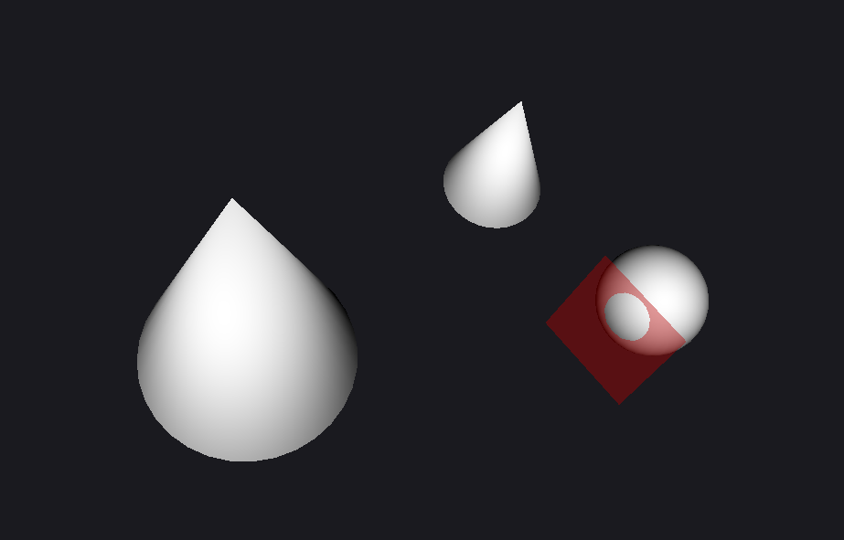
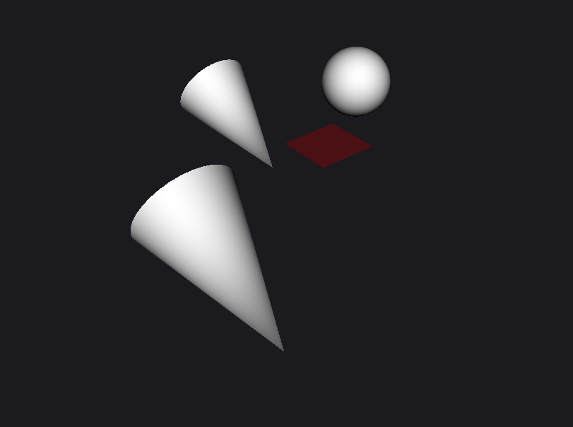
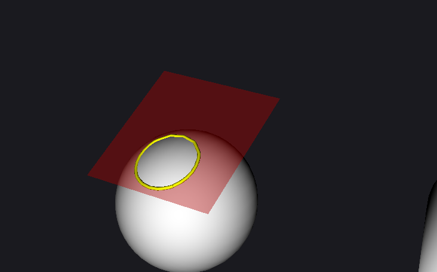
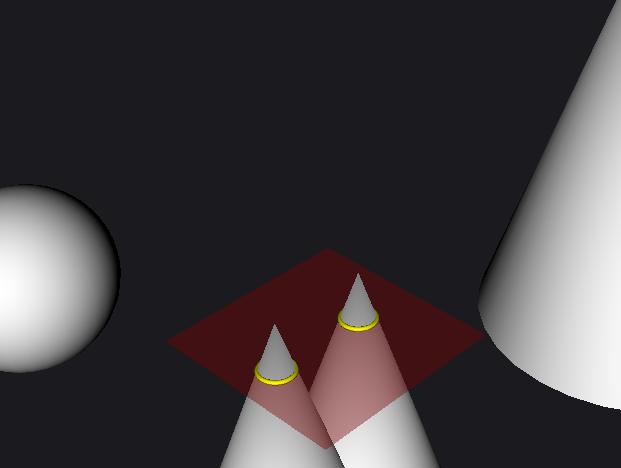

# Utils for 3D meshes


## Demo
To run demo that renders generated sphere and cone run: 
```
pip install -e .
python ./examples/demo.py
```


## Intersection with plane

```
is_intersected(mesh, plane) =  True
plane origin: [-1.0, 0.5, 0.0]; normal: [0.0, 2.0, 1.0]
```



```
is_intersected(mesh, plane) =  False
plane origin: [-1.0, 1.5, 0.0]; normal: [0.0, 2.0, 1.0]
```



```
Cut: 50 points, 1 polylines
```



```
Cut: 64 points, 2 polylines
```



## CLI

Use these function as CLI app:

```
pip install -e .

utils-3d sphere --radius 1.0 --out sphere.obj  

utils-3d cone --radius 1.0 --height 2.0 --out cone.obj 

utils-3d scale --mesh sphere.obj --coef 1.5 --out sphere_scaled.obj

# True & writes polylines to *.obj file
utils-3d is_intersect --mesh cone.obj --a 0.0 --b 0.0 --c 1.0 --d 0.5 --out cut.obj

# False
utils-3d is_intersect --mesh cone.obj --a 0.0 --b 0.0 --c 1.0 --d 1.5
```

Run pytests to ensure that it works as expected:
```
pytest
```

## Asymptotic complexity analysis

O(N)

### true / false option

For cases when all bounds (that are cached for vtk polydata) of mesh are located on the same side of plane, complexity is constant - O(1).

Alternatively, each face (triangle) of the mesh should be checked for the same condition: all vertices are located on the same side of the plane. Considering that verifying this condition requires computing dot product (O(1)) for each vertex to define sign of the distance to plane, overall complexity in the worst case scenarion is **O(N)** where N is number of faces. 

### defining polyline/perimeter of intersection

The complexity is still linear. 

For each triangle which has distances from vertices to plane not with the same sign, it is neccessary to define 2 points of intersection. These 2 points will form segmet of the final polyline. For each pair of poins with different signs, point of intersection can be defined as interpolation weighted by distance to the plane:

```
p_1 = (x_1, y_1, z_1)
p_2 = (x_2, y_2, z_2)

p_intr = p_1 + (p_2 - p_1) * (dist_1 / (dist_1 + dist_2))
```

Considering it takes constant time, the complexity for all vertices will rematin O(N)

In terms of memory the same O(N) applies for both cases to store the input, since no additional data are kept during computations (like for dynamic programing).


## Optimisation problem (Task 2)


### Intuition

Let's assume that the given non-convex, non-symmetrical volume is defined by a 3d mesh.

One of solutions would be applying an algorithm similar to Region Growth. 
The seed (1st sphere) could be initialised randomly. For example, we can define bounds of the defined volume and randomly select coordinates until sphere will be fully inside the volume. Or seed can be initialised near one of the faces (in opposite direction from the normal) on distance <sphere_radius>.

Let's make another assumption that the volume doesn't have areas that are more narrow that the small sphere and all spheres will be packed into a single connected blob.

So, basically, at the beginning we are going to initialise origin and direction, and then apply region growth. This process will be repeated with various values for origin and direction within some range. Ranges of values for coordinates of center could be [-<sphere_radius>, +<sphere_radius>] with step <sphere_radius>/100 for x/y/z and directions (e.g. 3 degree step in differen directions).
One of combinations with maximal number of packed spheres will be selected as the optional one.

Such logic could be well parellalised beyond 32 kernels that are common for CPUs. So, using language like CUDA could be beneficial for speed by utilising GPU computations.

Languages & libraries: mostly VTK for 3d data structures and operations, Python for prototyping, C++ for production and CUDA for GPU-optimisation.

### Pseudo-code

```

# For efficient is_sphere_inside
build_sdf(mesh, voxel):
    # 1) voxelize bbox at spacing = voxel
    # 2) compute unsigned distance to mesh via BVH (per voxel; Bounding Volume Hierarchy)
    # 3) assign sign via winding-number / ray parity test
    return SignedDistanceField(grid, voxel_size, origin)

is_sphere_inside(c, r, sdf):
    d = sdf.sample_trilinear(c)          # signed distance at c
    return d >= r                        # >= r ensures the whole sphere fits


region_grow_hcp(mesh, r, orientation, origin, sdf, seed_node):
    Q = [seed_node]; visited = set([seed_node]); centers = []
    while Q:
        u = Q.pop()
        p = lattice_position(u, orientation, origin, 2*r)
        if is_sphere_inside(p, r, sdf):
            centers.append(p)
            for v in hcp_neighbors(u):
                if v not in visited:
                    visited.add(v)
                    Q.push(v)
    return centers


function optsearch_region_growth(mesh, r, K, M):
    # Precompute
    bbox = mesh.bounding_box()
    sdf  = try_build_sdf(mesh, voxel=r/3)  # None if not available

    best = {centers: [], orientation: None, origin: None, score: -INF}

    for orientation in SAMPLE_ORIENTATIONS(K):
        for origin in SAMPLE_TRANSLATIONS_IN_UNIT_CELL(M):
            seed = get_seed(orientation, origin)
            centers = region_grow_single_pose(mesh, r, orientation, origin, sdf, seed)
            score = len(centers)  # or packing fraction estimate
            if score > best.score:
                best = {centers, orientation, origin, score}

    return {centers: best.centers, orientation: best.orientation, origin: best.origin}

```

### Validation and verification

It can be validated with simple volumes like various cubes where it is possible to define analytically the best possible option. Also, it makes sense to make visual check by rendering by volume packed following the found solution.